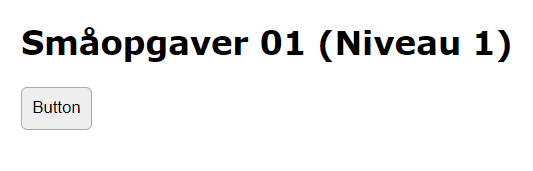

# Småopgaver 01 (Niveau 1)

04-02-2019

Hver gang knappen trykkes, skifter den farve.<br>
Den skal skifte mellem 2 farver, f.eks. "#eee" (grå) og "#7f7" (grøn).

Det er IKKE tilladt, at lave en IF-sætning på selve farvekoden. Dvs., hvis de 2 farver du har valgt f.eks. er "#eee" og "#7f7", så må du ikke skrive:

```javascript
// Ikke tilladt!
if (currentColor == "#eee") { ... }
```

